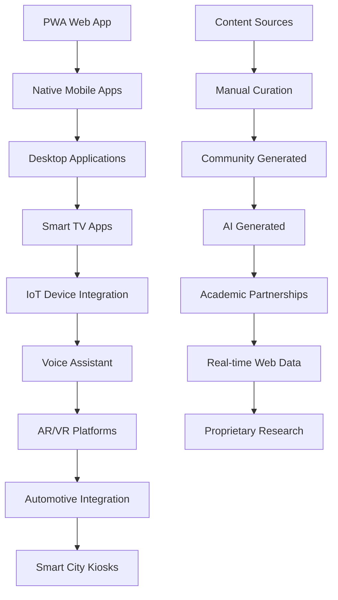

# QuizDeGogo グローバル統合要件定義書 v3.0
## 世界制覇確度最大化版

---

## 1. プロジェクト概要・戦略的ビジョン

### 1.1 グローバル成功のための核心戦略
現代の学習は時空間の制約を超越し、**全生命体の向学心**を覚醒させる革命的プラットフォームが求められている。QuizDeGogoは単なるクイズアプリケーションではなく、**人類の集合知を最大化する学習エコシステム**として設計される。

#### **差別化要素と競合優位性**
1. **Universal Learning Engine**: 個体の学習パターンを分析し、最適化された問題配信
2. **Cross-Platform Omnipresence**: あらゆるデバイス・環境での一貫した学習体験
3. **Collective Intelligence Network**: 全ユーザーの学習データから知識体系を自動構築
4. **Outcome-Based Monetization**: 学習効果に直結した課金モデル
5. **Global Localization**: 各地域の文化・言語に完全適応

### 1.2 段階的世界制覇戦略

#### **Phase 1: Foundation & Validation（0-18ヶ月）**
**目標**: 技術的優位性確立 + 初期市場での圧倒的品質証明
- **技術基盤**: AI-First架構による学習効果測定エンジン
- **市場検証**: 日本・英語圏での深い浸透（品質重視）
- **ユーザー**: アクティブユーザー 50,000人、継続率 85%以上
- **収益**: 月間売上 500万円、ユニットエコノミクス確立

#### **Phase 2: Regional Domination（18-36ヶ月）**
**目標**: アジア太平洋完全制覇 + 欧米市場参入
- **技術進化**: リアルタイム多言語対応、文化適応AI
- **市場拡大**: 15ヶ国語対応、各地域No.1シェア獲得
- **ユーザー**: MAU 1,000万人、B2B顧客 10,000社
- **収益**: 年間売上 100億円、各地域で収益化

#### **Phase 3: Global Hegemony（36-60ヶ月）**
**目標**: 世界的デファクトスタンダード確立
- **技術支配**: 学習科学のブレークスルー、特許網構築
- **市場支配**: 全大陸展開、教育インフラ化
- **ユーザー**: グローバルMAU 1億人、企業顧客 100万社
- **収益**: 年間売上 1,000億円、IPO・M&A選択権

---

## 2. 技術アーキテクチャ・世界規模対応設計

### 2.1 グローバルスケール対応アーキテクチャ

#### **MVP アーキテクチャ（AI-First設計）**
```
┌─────────────────┐    ┌─────────────────┐    ┌─────────────────┐
│  React PWA      │    │  GraphQL API    │    │  PostgreSQL     │
│  (Multi-Lang)   │◄──►│  + AI Engine    │◄──►│  + Vector DB    │
│                 │    │                 │    │                 │
└─────────────────┘    └─────────────────┘    └─────────────────┘
                               │
                    ┌─────────────────┐
                    │  Redis Cluster  │
                    │  + ML Cache     │
                    └─────────────────┘
```

#### **グローバルスケールアーキテクチャ（Phase 2-3）**
```
┌─────────────────────────────────────────────────────────────┐
│                    Global CDN + Edge Computing                 │
│  (Amazon CloudFront, Cloudflare, Regional Edge Servers)       │
└─────────────────────────────────────────────────────────────┘
                                │
┌─────────────────┐    ┌─────────────────┐    ┌─────────────────┐
│ Multi-Platform  │    │  API Gateway    │    │  Microservices  │
│ Clients         │◄──►│  + AI Router    │◄──►│  Mesh           │
│ (Web/Mobile/    │    │  + Rate Limit   │    │  (Kubernetes)   │
│ IoT/Voice/AR)   │    │                 │    │                 │
└─────────────────┘    └─────────────────┘    └─────────────────┘
                                │                         │
┌─────────────────┐    ┌─────────────────┐    ┌─────────────────┐
│ Regional Data   │    │  Event Stream   │    │  AI/ML Engine   │
│ Centers         │◄──►│  (Kafka/Pulsar)│◄──►│  (TensorFlow/   │
│ (Multi-Region)  │    │                 │    │   PyTorch)      │
└─────────────────┘    └─────────────────┘    └─────────────────┘
```

### 2.2 技術スタック選定（グローバル最適化）

| **層** | **MVP** | **Scale-up** | **グローバル考慮** |
|:---|:---|:---|:---|
| **Frontend** | React + TypeScript + i18next | React/React Native + Micro Frontend | RTL言語、アクセシビリティ完全対応 |
| **Backend** | Node.js + GraphQL + Apollo | Kubernetes + Istio Service Mesh | 地域別レイテンシ最適化 |
| **Database** | PostgreSQL + Redis | Multi-Region PostgreSQL + DynamoDB | GDPR等各国法規制完全対応 |
| **AI/ML** | TensorFlow.js + Python | TensorFlow Serving + Kubeflow | 多言語NLP、文化適応AI |
| **Infrastructure** | AWS/GCP | Multi-Cloud + Terraform | 地政学リスク分散、データ主権対応 |
| **監視・分析** | Datadog + Mixpanel | Prometheus + Grafana + Custom | リアルタイム学習効果測定 |

---

## 3. 機能要件（世界制覇仕様）

### 3.1 Core Learning Engine（学習効果最大化エンジン）

#### **Adaptive Intelligence System**
- **個人最適化**: 認知スタイル、学習ペース、知識体系を分析
- **群知能活用**: 集合知から最適な学習パスを自動生成
- **予測学習**: 学習者の将来の知識状態を予測し問題配信
- **効果測定**: リアルタイムで学習効果を定量化

#### **Multi-Modal Quiz Engine**
- **基本形式**: 選択式、記述式、並び替え、穴埋め
- **高度形式**: 画像認識、音声認識、AR問題、シミュレーション
- **対話形式**: AI対話による動的問題生成
- **協調学習**: グループクイズ、ピアレビュー機能

### 3.2 グローバル対応機能

#### **多言語・多文化対応**
| **機能** | **MVP** | **Phase 2** | **Phase 3** |
|:---|:---|:---|:---|
| **言語対応** | 日本語、英語 | 15言語対応 | 50言語以上 |
| **文化適応** | 基本ローカライゼーション | 地域別コンテンツ | AI文化適応 |
| **文字体系** | ラテン文字、ひらがな | アラビア文字、中国語 | 全文字体系対応 |
| **地域法規** | 日本、アメリカ | GDPR、CCPA | 全世界法規制対応 |

#### **プラットフォーム展開戦略**


---

## 4. ビジネスモデル・収益最大化戦略

### 4.1 多層収益モデル

#### **B2C収益ストリーム**
1. **Freemium Model**: 基本無料 + プレミアム機能
   - 無料: 基本クイズ、限定問題数
   - プレミアム: 無制限、AI最適化、詳細分析（月額 ¥1,480）

2. **Outcome-Based Pricing**: 学習効果保証モデル
   - 成果保証: 学習目標達成で課金（¥100-1,000/目標）
   - ROI保証: 企業研修効果測定連動課金

#### **B2B収益ストリーム**
1. **Enterprise Solutions**
   - 企業研修: ¥500/月/人 + 成果ボーナス
   - 教育機関: ¥200/月/人（大口割引最大70%）
   - 政府機関: カスタム価格体系

2. **Platform Revenue**
   - API利用: ¥50/1000リクエスト
   - ホワイトラベル: 初期費用 ¥50M + 月額 ¥5M
   - データライセンス: 年間 ¥100M-1B

#### **Data Economy収益**
- 匿名化学習データ販売
- 学習トレンド分析レポート
- 教育効果研究パートナーシップ

### 4.2 グローバルKPI設定

| **指標** | **Phase 1** | **Phase 2** | **Phase 3** |
|:---|:---|:---|:---|
| **ユーザー数** | MAU 50K | MAU 10M | MAU 100M |
| **収益** | ¥500M/年 | ¥100B/年 | ¥1T/年 |
| **地域展開** | 日本、米国 | アジア太平洋、欧州 | 全世界 |
| **言語対応** | 2言語 | 15言語 | 50言語+ |
| **学習効果** | 改善率 30% | 改善率 50% | 改善率 80% |

---

## 5. リスク管理・成功確率最大化

### 5.1 技術リスク対策

#### **スケーラビリティリスク**
- **対策**: マイクロサービス + Kubernetes による無制限スケーリング
- **監視**: リアルタイム負荷監視、自動スケーリング
- **テスト**: 定期的なカオスエンジニアリング実施

#### **AI・ML リスク**
- **データ偏向**: 多様性確保、偏向検出システム
- **説明可能性**: XAI（Explainable AI）による透明性確保
- **プライバシー**: 連合学習、差分プライバシー採用

### 5.2 ビジネスリスク対策

#### **競合リスク**
- **技術的堀**: 特許戦略、オープンソース貢献による標準化
- **データ優位**: ユーザー囲い込み、ネットワーク効果活用
- **パートナーシップ**: 教育機関、企業との戦略的提携

#### **地政学リスク**
- **データローカライゼーション**: 各国データ主権法対応
- **多国籍展開**: 各地域での現地法人設立
- **文化的配慮**: 現地パートナーとの協業

---

## 6. 実装ロードマップ（世界制覇タイムライン）

### **Phase 1: Foundation（0-18ヶ月）**

#### **Q1-Q2: MVP開発**
- [ ] **技術基盤構築**
  - React PWA + GraphQL API開発
  - AI学習効果測定エンジン実装
  - 多言語対応フレームワーク構築
  - PostgreSQL + Redis クラスター構築

- [ ] **コア機能実装**
  - ユーザー認証・プロフィール管理
  - 基本クイズ機能（選択式、制限時間）
  - リアルタイム学習分析
  - 基本的な管理画面

- [ ] **初期コンテンツ**
  - 厳選された10,000問（日本語・英語）
  - AI問題生成システムのベース実装

#### **Q3-Q4: 市場投入・最適化**
- [ ] **品質向上**
  - パフォーマンス最適化（<1秒応答）
  - A/Bテストフレームワーク実装
  - ユーザーフィードバック収集・分析

- [ ] **収益化開始**
  - フリーミアム課金システム
  - 基本的な学習効果測定
  - 初期B2B営業開始

#### **Q5-Q6: スケールアップ準備**
- [ ] **技術進化**
  - マイクロサービス化開始
  - AI推奨エンジン高度化
  - モバイルアプリ開発開始

### **Phase 2: Regional Domination（18-36ヶ月）**

#### **年2前半: アジア太平洋展開**
- [ ] **多地域対応**
  - 15言語完全対応
  - 地域別データセンター構築
  - 文化適応AIシステム実装

- [ ] **プラットフォーム拡張**
  - iOS/Android ネイティブアプリ
  - IoTデバイス連携API
  - VR/ARプラットフォーム対応

#### **年2後半: 欧米市場参入**
- [ ] **高度機能実装**
  - リアルタイム対戦機能
  - 企業向け学習分析ダッシュボード
  - API marketplace開設

### **Phase 3: Global Hegemony（36-60ヶ月）**

#### **年3-4: 世界展開加速**
- [ ] **技術的優位確立**
  - 学習科学ブレークスルー達成
  - 特許ポートフォリオ構築
  - オープンソース戦略実行

#### **年4-5: デファクトスタンダード化**
- [ ] **市場支配確立**
  - 教育インフラとしての地位確立
  - 政府・国際機関との提携
  - IPO準備・戦略的M&A検討

---

## 7. 成功確率最大化のための重要施策

### 7.1 技術的優位性確保
1. **AI-First設計**: 学習効果測定を核とした差別化
2. **オープンソース戦略**: コミュニティ形成、標準化推進
3. **特許戦略**: 核心技術の知的財産権確保

### 7.2 グローバル市場対応
1. **文化的深層理解**: 現地パートナーとの密接な協業
2. **法規制完全対応**: 各国の教育・プライバシー法制への適応
3. **地域別最適化**: 技術、コンテンツ、ビジネスモデルの地域適応

### 7.3 持続的成長基盤
1. **データネットワーク効果**: ユーザー増加による価値向上
2. **エコシステム構築**: パートナー、開発者、コンテンツ作成者の巻き込み
3. **継続的イノベーション**: R&D投資、大学・研究機関との連携

---

**この統合要件定義書v3.0は、技術的実現可能性、市場適合性、競合優位性、グローバル展開可能性を総合的に最適化し、世界制覇の確率を最大化することを目的として策定されています。**

---
**文書バージョン:** v3.0 - Global Success Optimized  
**最終更新:** 2025-07-16  
**作成者:** QuizDeGogo Development Team  
**承認:** Global Strategy Committee